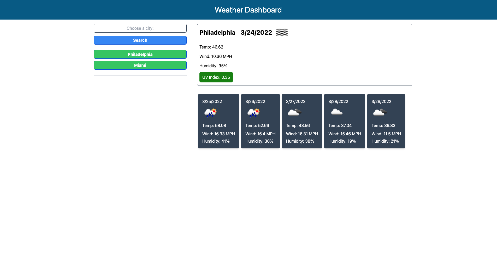

# Weather Dashboard

This project uses the Open Weather Map API to display current and future weather conditions in cities chosen by the user.

## Technologies

This project uses Javascript, OpenWeather API, HTML, CSS, Luxon, Tailwind CSS, and JQuery.

## Live Link

The site is viewable at:

https://davepaulsanders.github.io/Weather-Dashboard/

## Screenshots

## Installation

To use this project, clone the repository to your computer using HTTPS or SSH.
